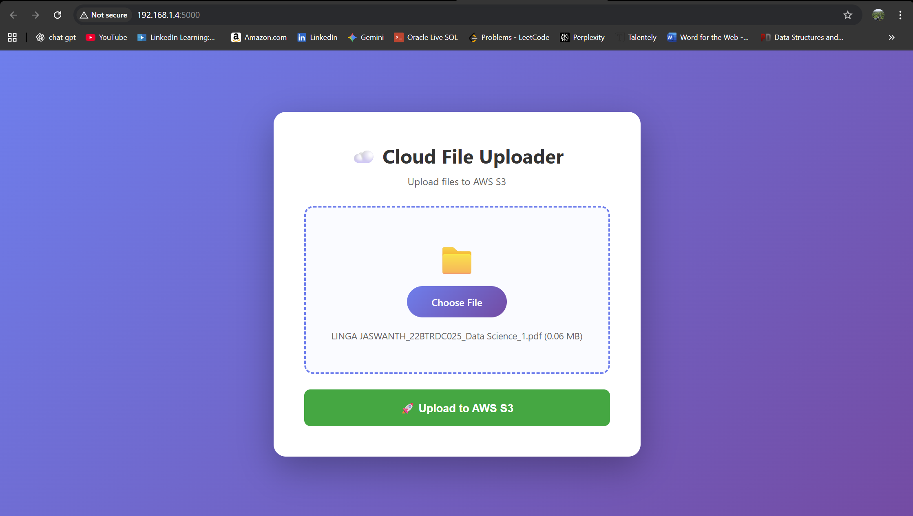

# AWS File Uploader

A simple web application to upload files to AWS S3. Built with Flask and boto3.

---

## Features

- Upload files (supports images, docs, zips, etc.) to Amazon S3.
- Enforces file type and max upload size.
- Secure: AWS credentials are loaded via environment variables.
- Ready for deployment to AWS Elastic Beanstalk.

## Technologies Used

- Python 3.x
- Flask
- boto3
- AWS S3
- Werkzeug, Flask-CORS

## Setup Instructions

1. **Clone the repository**

git clone https://github.com/yourusername/aws-file-uploader.git
cd aws-file-uploader

2. **Create a virtual environment and activate it**

python -m venv venv

3. **Install requirements**

pip install -r requirements.txt

4. **Set environment variables in your terminal** (replace values with your actual AWS keys and S3 bucket info, each time you start a new session):
- On Windows (PowerShell):
  ```
  $env:AWS_ACCESS_KEY_ID="your-access-key"
  $env:AWS_SECRET_ACCESS_KEY="your-secret-key"
  $env:S3_BUCKET="your-bucket-name"
  $env:S3_REGION="ap-south-1"
  ```
- On Mac/Linux:
  ```
  export AWS_ACCESS_KEY_ID="your-access-key"
  export AWS_SECRET_ACCESS_KEY="your-secret-key"
  export S3_BUCKET="your-bucket-name"
  export S3_REGION="ap-south-1"
  ```

5. **Run the app**

python application.py

Then open [http://localhost:5000/](http://localhost:5000/) in your browser.

Project Structure

.
├── application.py
├── requirements.txt
├── templates/
│   └── index.html
├── .gitignore
└── README.md

## This app is ready for cloud deployment (tested on AWS Elastic Beanstalk):

1. **Install AWS EB CLI**  
   `pip install awsebcli`
2. **Initialize Beanstalk**  
   `eb init -p python-3.11 aws-file-uploader --region ap-south-1`
3. **Create and deploy**  
   `eb create file-uploader-env`
4. **Set environment variables**  
   `eb setenv AWS_ACCESS_KEY_ID=... AWS_SECRET_ACCESS_KEY=... S3_BUCKET=... S3_REGION=ap-south-1`
5. **Open deployed app**  
   `eb open`

## Screenshots 



## Learning and Found Tricky

- Learned to connect and secure a Flask backend with AWS S3 through environment variables.
- Found it tricky to correctly set and debug environment variables—issues only cleared up after checking variable names and bucket/region details.
- Used AI to help troubleshoot AWS signature, permission, and deployment issues.
- Before I did some of the project similar but using aws to store and making it online is my first time and learnt a lot from this
and what i have fiund tricky was uploading the file and saving it in aws in all at once but rest i learnt a lot

## Secret Management

All AWS credentials are set through environment variables locally and on deployed AWS EB instance. They are neither hardcoded in the code nor pushed to the repository.  
The `.env` file and all secrets are excluded via `.gitignore` for security.

## AI Assistance Statement

AI tools were used for code generation (Flask app structure, debugging, and README templating) and to solve deployment errors.

